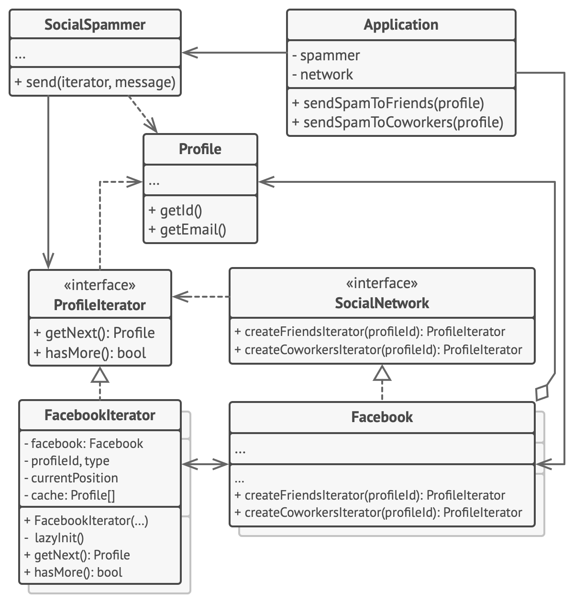

In this example, the Iterator pattern is used to walk through a special kind of collection which encapsulates access to Facebook’s social graph. The collection provides several iterators that can traverse profiles in various ways.



The ‘friends’ iterator can be used to go over the friends of a given profile. The ‘colleagues’ iterator does the same, except it omits friends who don’t work at the same company as a target person. Both iterators implement a common interface which allows clients to fetch profiles without diving into implementation details such as authentication and sending REST requests.

The client code isn’t coupled to concrete classes because it works with collections and iterators only through interfaces. If you decide to connect your app to a new social network, you simply need to provide new collection and iterator classes without changing the existing code.

```
// The collection interface must declare a factory method for
// producing iterators. You can declare several methods if there
// are different kinds of iteration available in your program.
interface SocialNetwork is
    method createFriendsIterator(profileId):ProfileIterator
    method createCoworkersIterator(profileId):ProfileIterator


// Each concrete collection is coupled to a set of concrete
// iterator classes it returns. But the client isn't, since the
// signature of these methods returns iterator interfaces.
class Facebook implements SocialNetwork is
    // ... The bulk of the collection's code should go here ...

    // Iterator creation code.
    method createFriendsIterator(profileId) is
        return new FacebookIterator(this, profileId, "friends")
    method createCoworkersIterator(profileId) is
        return new FacebookIterator(this, profileId, "coworkers")


// The common interface for all iterators.
interface ProfileIterator is
    method getNext():Profile
    method hasMore():bool


// The concrete iterator class.
class FacebookIterator implements ProfileIterator is
    // The iterator needs a reference to the collection that it
    // traverses.
    private field facebook: Facebook
    private field profileId, type: string

    // An iterator object traverses the collection independently
    // from other iterators. Therefore it has to store the
    // iteration state.
    private field currentPosition
    private field cache: array of Profile

    constructor FacebookIterator(facebook, profileId, type) is
        this.facebook = facebook
        this.profileId = profileId
        this.type = type

    private method lazyInit() is
        if (cache == null)
            cache = facebook.socialGraphRequest(profileId, type)

    // Each concrete iterator class has its own implementation
    // of the common iterator interface.
    method getNext() is
        if (hasMore())
            result = cache[currentPosition]
            currentPosition++
            return result

    method hasMore() is
        lazyInit()
        return currentPosition < cache.length


// Here is another useful trick: you can pass an iterator to a
// client class instead of giving it access to a whole
// collection. This way, you don't expose the collection to the
// client.
//
// And there's another benefit: you can change the way the
// client works with the collection at runtime by passing it a
// different iterator. This is possible because the client code
// isn't coupled to concrete iterator classes.
class SocialSpammer is
    method send(iterator: ProfileIterator, message: string) is
        while (iterator.hasMore())
            profile = iterator.getNext()
            System.sendEmail(profile.getEmail(), message)


// The application class configures collections and iterators
// and then passes them to the client code.
class Application is
    field network: SocialNetwork
    field spammer: SocialSpammer

    method config() is
        if working with Facebook
            this.network = new Facebook()
        if working with LinkedIn
            this.network = new LinkedIn()
        this.spammer = new SocialSpammer()

    method sendSpamToFriends(profile) is
        iterator = network.createFriendsIterator(profile.getId())
        spammer.send(iterator, "Very important message")

    method sendSpamToCoworkers(profile) is
        iterator = network.createCoworkersIterator(profile.getId())
        spammer.send(iterator, "Very important message")
```