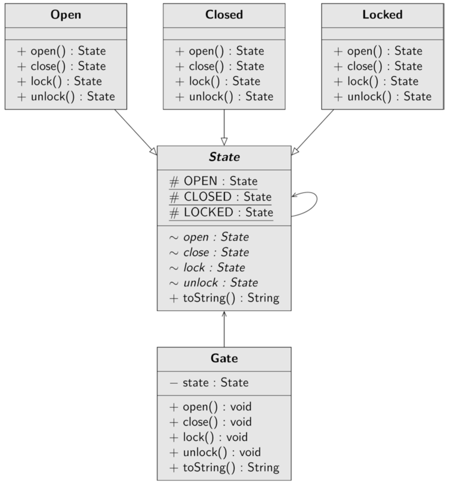

Think of a garage door. The door
can be open, but it can also be closed. You can open a closed door; however, there is little
point in trying to open an open door. But how can you prevent someone from trying to
open an open gate or close a closed gate? The state pattern solves this problem by representing each state by its own object; as a result, everyone can only do what is supposed to be allowed in the current state

DrawBacks

Nevertheless, two disadvantages should not be concealed. First, you need a separate
class for each state. Some state characteristics depend “somehow” on each other, others
not at all. This creates the risk that the project becomes confusing. Without a clear state
diagram, you may be at a loss.
A second point can become a problem. You create a new object with every state change.
If you have frequent state changes or the state class is very costly to instantiate, this solution is not to be favored