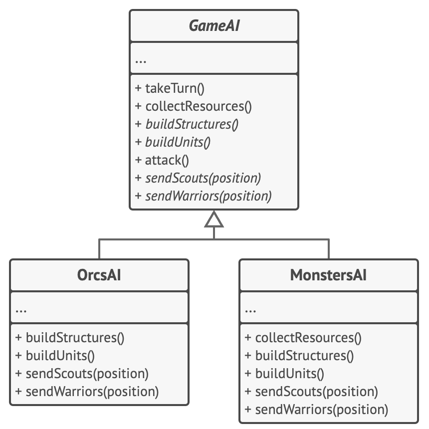

In this example, the Template Method pattern provides a “skeleton” for various branches of artificial intelligence in a simple strategy video game.

All races in the game have almost the same types of units and buildings. Therefore you can reuse the same AI structure for various races, while being able to override some of the details. With this approach, you can override the orcs’ AI to make it more aggressive, make humans more defense-oriented, and make monsters unable to build anything. Adding a new race to the game would require creating a new AI subclass and overriding the default methods declared in the base AI class.

// The abstract class defines a template method that contains a
// skeleton of some algorithm composed of calls, usually to
// abstract primitive operations. Concrete subclasses implement
// these operations, but leave the template method itself
// intact.
class GameAI is
    // The template method defines the skeleton of an algorithm.
    method turn() is
        collectResources()
        buildStructures()
        buildUnits()
        attack()

    // Some of the steps may be implemented right in a base
    // class.
    method collectResources() is
        foreach (s in this.builtStructures) do
            s.collect()

    // And some of them may be defined as abstract.
    abstract method buildStructures()
    abstract method buildUnits()

    // A class can have several template methods.
    method attack() is
        enemy = closestEnemy()
        if (enemy == null)
            sendScouts(map.center)
        else
            sendWarriors(enemy.position)

    abstract method sendScouts(position)
    abstract method sendWarriors(position)

// Concrete classes have to implement all abstract operations of
// the base class but they must not override the template method
// itself.
class OrcsAI extends GameAI is
    method buildStructures() is
        if (there are some resources) then
            // Build farms, then barracks, then stronghold.

    method buildUnits() is
        if (there are plenty of resources) then
            if (there are no scouts)
                // Build peon, add it to scouts group.
            else
                // Build grunt, add it to warriors group.

    // ...

    method sendScouts(position) is
        if (scouts.length > 0) then
            // Send scouts to position.

    method sendWarriors(position) is
        if (warriors.length > 5) then
            // Send warriors to position.

// Subclasses can also override some operations with a default
// implementation.

class MonstersAI extends GameAI is
    method collectResources() is
        // Monsters don't collect resources.

    method buildStructures() is
        // Monsters don't build structures.

    method buildUnits() is
        // Monsters don't build units.